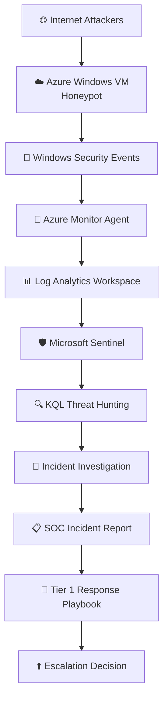

# Microsoft Sentinel SOC Investigation Lab

### 🔐 Azure Honeypot Deployment | Threat Detection | Incident Investigation | Microsoft Sentinel

This project simulates a real-world Tier 1 Security Operations Center (SOC) investigation by monitoring, analyzing, documenting, and responding to Remote Desktop Protocol (RDP) brute-force attacks using Microsoft Sentinel.

The objective extends beyond log collection. It follows the complete SOC investigation lifecycle—from security monitoring and alert triage to threat hunting, incident documentation, and playbook-driven response—reflecting workflows commonly used in enterprise Security Operations Centers.

---

 # 🏢 Business Problem & 🛠️ Project Objectives

## 🏢 Business Problem

Organizations expose Windows servers to the Internet for administrative purposes. These systems become frequent targets of automated password-spraying and brute-force attacks.

Without centralized monitoring, analysts may fail to identify suspicious authentication activity quickly, increasing the risk of unauthorized access.

This project demonstrates how Microsoft Sentinel can be used to detect, investigate, prioritize, and document these attacks before they become successful compromises.

## 🛠️ Project Objectives

The primary goal of this project is to simulate the day-to-day operational responsibilities of a Tier 1 SOC Analyst by executing a structured, end-to-end incident investigation workflow:

1. ☁️ Deploy a Windows Honeypot in Microsoft Azure
2. 📥 Collect real-world attacker telemetry
3. 🖥️ Monitor security events using Microsoft Sentinel
4. 🔍 Investigate brute-force attacks using Kusto Query Language (KQL)
5. 👹 Identify attacker behavior and attack patterns
6. 📄 Document the incident investigation
7. 🛡️ Execute a Tier 1 Incident Response Playbook
8. 🚨 Demonstrate the Incident Escalation process from Tier 1 to Tier 2
9. 📊 Produce threat hunting findings and security observations
10. ✅ Simulate an enterprise SOC investigation workflow

---

# 🛡️ SOC Responsibilities Demonstrated

## 🖥️ Security Monitoring

- 👁️ Continuously monitored Windows Security Events using Microsoft Sentinel.
- 📥 Collected authentication logs from an exposed Azure Virtual Machine.

## 🚨 Alert Triage

Investigated repeated failed Remote Desktop Protocol (RDP) authentication attempts.

Performed initial analysis by reviewing:

- 🌐 Source IP Address
- 👤 Username targeted
- 🔢 Failed Login Count
- ⏰ Time of Activity
- 🌍 Geographic Origin

## 🔍 Incident Investigation

Performed investigation of:

- 🆔 Event ID 4625 (Failed Logon)
- 📊 Login frequency
- 🔨 Brute-force attack behaviour
- 🏳️ Source countries
- 🛑 Suspicious IP addresses

## 🏹 Threat Hunting

Developed KQL queries to identify:

- 🔝 Top attacking IP addresses
- 🎯 Most targeted usernames
- 🗺️ Login attempts by country
- ⚡ High frequency authentication failures

## 📄 Incident Documentation

Documented findings using a structured investigation report including:

- 📝 Detection Summary
- 🏷️ Indicators of Compromise (IOCs)
- 🧠 Analysis
- ⚠️ Risk Assessment
- 🛠️ Recommended Mitigation

## ⚡ Escalation Decision

Established escalation criteria for potential credential compromise based on:

- 📈 Excessive authentication failures
- 🔑 Successful login after repeated failures
- 👥 Multiple usernames targeted from one IP
- 🚩 High-risk geographic source

---

# 🏗️ Project Architecture

---

# 🛠️ Technologies Used

| 📁 Category | 🛠️ Technologies Used |
| :--- | :--- |
| **☁️ Cloud Infrastructure** | • Microsoft Azure • Azure Virtual Machine (VM) |
| **🛡️ SIEM** | • Microsoft Sentinel |
| **👁️ Monitoring** | • Azure Monitor Agent |
| **📊 Log Management** | • Azure Log Analytics Workspace |
| **🔒 Network Security** | • Azure Network Security Groups (NSG) • Windows Defender Firewall |
| **📜 Scripting** | • PowerShell |
| **🔍 Query Language** | • Kusto Query Language (KQL) |
| **🌐 Threat Intelligence** | • Virus Total |
| **🖥️ Operating System** | • Windows Server |

# 🔄 Investigation Workflow

1. 🚀 Deploy Azure Honeypot
2. 📦 Collect Windows Security Logs
3. ➡️ Forward logs into Sentinel
4. 🔍 Query logs using KQL
5. 🌐 Enrich attacker IP with Geo-IP information
6. 📊 Visualize attacks on Sentinel Workbook
7. 📝 Document investigation findings
8. 🛠️ Recommend mitigation strategies

# 📊 Dashboard

The Sentinel Workbook visualizes attack activity across multiple countries using enriched Geo-IP data.

# 🌍 Geo-IP Investigation

Each attacker IP address is enriched using ipgeolocation.io API to identify:

- 🏳️ Country
- 📍 Region
- 🏢 ISP
- 🗺️ Coordinates
- 🏷️ ASN Information

  

# 🔑 Key Findings

- ⚡ Internet-facing Windows systems receive automated brute-force attacks within hours.
- 🌍 Most attacks originate from globally distributed IP addresses.
- 🛑 Repeated failed authentication attempts are common indicators of credential attacks.
- 🚀 Microsoft Sentinel enables efficient investigation using KQL and centralized log collection.

# 🧠 Lessons Learned 

This project improved my understanding of:

- 🛡️ Microsoft Sentinel
- 🖥️ Security Monitoring
- 🚨 Alert Triage
- 🏹 Threat Hunting
- 🔍 Incident Investigation
- ✍️ KQL Query Development
- 📄 SOC Documentation
- ⚡ Incident Escalation

# 🚀 Future Improvements

- 🛡️ Microsoft Defender XDR Integration
- ⚙️ Analytics Rules
- 🤖 Automated Playbooks
- ⚡ SOAR Automation
- 🗺️ MITRE ATT&CK Mapping
- ⚠️ Incident Severity Classification
- 📊 Automated Alert Prioritization

### 🕵️‍♂️ Queried security logs using KQL (Kusto Query Language) to detect patterns in failed RDP logins (Event ID 4625) and investigate anomalous login behavior.

### 🌍 Enriched log data with Geo-IP context using ipgeolocation.io APIs, identifying the origin of attack traffic.

### 📈 Built a custom Sentinel Workbook to visualize attack sources on a world map and assist in threat hunting and incident response.

### 📌 Observations:
#### Live attack data shows repeated brute-force attempts from countries like USA, Europ, Pakistan and Australia all plotted in near real-time.

