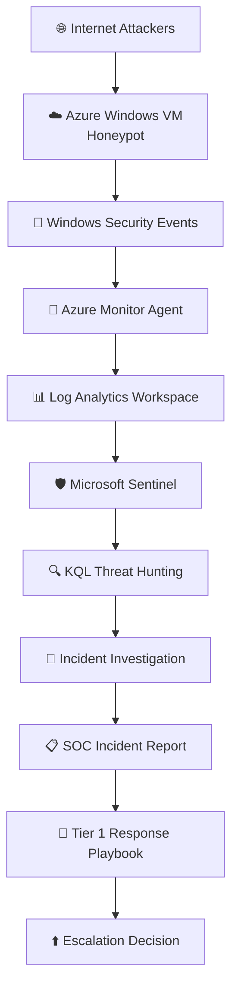
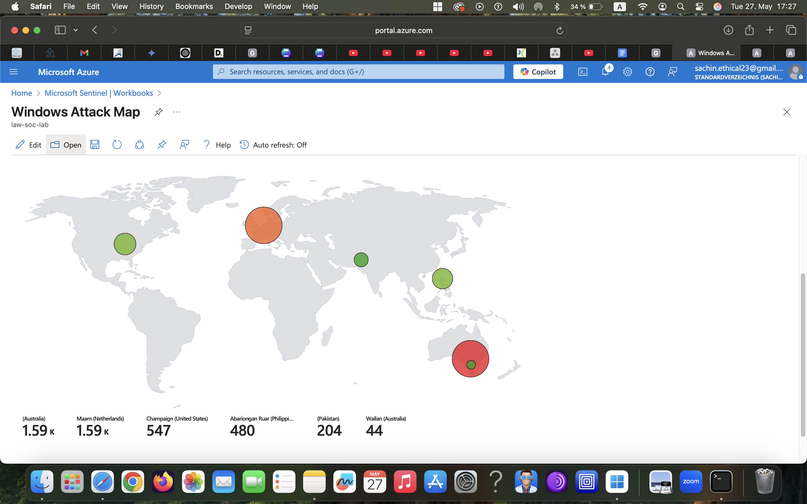
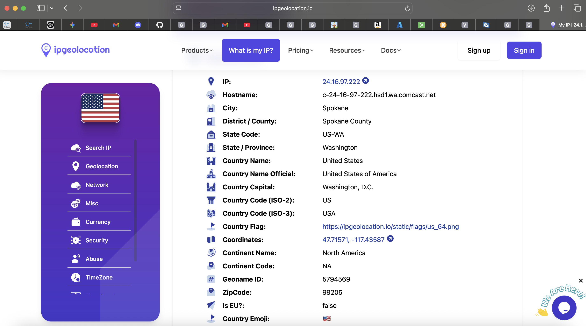

# Microsoft Sentinel SOC Investigation Lab

### 🔐 Azure Honeypot | Security Monitoring | Threat Hunting | Incident Investigation | Microsoft Sentinel

This project simulates a real-world Tier 1 Security Operations Center (SOC) investigation by monitoring, analyzing, documenting, and responding to Remote Desktop Protocol (RDP) brute-force attacks using Microsoft Sentinel.

The objective extends beyond log collection. It follows the complete SOC investigation lifecycle—from security monitoring and alert triage to threat hunting, incident documentation, and playbook-driven response—reflecting workflows commonly used in enterprise Security Operations Centers.

---

 # 🏢 Business Problem & 🛠️ Project Objectives

## 🏢 Business Problem

Organizations frequently expose Windows servers to the Internet for remote administration. These Internet-facing systems are common targets for automated password spraying and brute-force attacks.

Without centralized monitoring, analysts may fail to identify suspicious authentication activity quickly, increasing the risk of unauthorized access.

This project demonstrates how Microsoft Sentinel can be used to detect, investigate, prioritize, and document these attacks before they become successful compromises.

## 🛠️ Project Objectives

The primary goal of this project is to simulate the day-to-day operational responsibilities of a Tier 1 SOC Analyst by executing a structured, end-to-end incident investigation workflow:

1. ☁️ Deploy a Windows Honeypot in Microsoft Azure
2. 📥 Collect real-world attacker telemetry
3. 🖥️ Monitor security events using Microsoft Sentinel
4. 🔍 Investigate brute-force attacks using Kusto Query Language (KQL)
5. 👹 Identify attacker behavior and attack patterns
6. 📄 Document the incident investigation
7. 🛡️ Execute a Tier 1 Incident Response Playbook
8. 🚨 Demonstrate the Incident Escalation process from Tier 1 to Tier 2
9. 📊 Perform proactive threat hunting using KQL.
10. ✅ Simulate an enterprise SOC investigation workflow

---

# 🛡️ SOC Responsibilities Demonstrated

## 🖥️ Security Monitoring

- 👁️ Continuously monitored Windows Security Events using Microsoft Sentinel.
- 📥 Collected authentication logs from an exposed Azure Virtual Machine.

## 🚨 Alert Triage

Investigated repeated failed Remote Desktop Protocol (RDP) authentication attempts.

Performed initial triage by analysing:

- 🌐 Source IP Address
- 👤 Username targeted
- 🔢 Failed Login Count
- ⏰ Time of Activity
- 🌍 Geographic Origin

## 🔍 Incident Investigation

Performed investigation of:

- 🆔 Event ID 4625 (Failed Logon)
- 📊 Login frequency
- 🔨 Brute-force attack behaviour
- 🏳️ Source countries
- 🛑 Suspicious IP addresses

## 🏹 Threat Hunting

Developed KQL queries to identify:

- 🔝 Top attacking IP addresses
- 🎯 Most targeted usernames
- 🗺️ Login attempts by country
- ⚡ High frequency authentication failures

## 📄 Incident Documentation

Documented findings using a structured investigation report including:

- 📝 Detection Summary
- 🏷️ Indicators of Compromise (IOCs)
- 🧠 Analysis
- ⚠️ Risk Assessment
- 🛠️ Recommended Mitigation

## ⚡ Escalation Decision

Established escalation criteria for potential credential compromise based on:

- 📈 Excessive authentication failures
- 🔑 Successful login after repeated failures
- 👥 Multiple usernames targeted from one IP
- 🚩 High-risk geographic source

---

# 🏗️ Project Architecture

---

# 🛠️ Technologies Used

| 📁 Category | 🛠️ Technologies Used |
| :--- | :--- |
| **☁️ Cloud Infrastructure** | • Microsoft Azure • Azure Virtual Machine (VM) |
| **🛡️ SIEM** | • Microsoft Sentinel |
| **👁️ Monitoring** | • Azure Monitor Agent |
| **📊 Log Management** | • Azure Log Analytics Workspace |
| **🔒 Network Security** | • Azure Network Security Groups (NSG) • Windows Defender Firewall |
| **📜 Scripting** | • PowerShell |
| **🔍 Query Language** | • Kusto Query Language (KQL) |
| **🌐 Threat Intelligence** | • Virus Total |
| **🖥️ Operating System** | • Windows Server |

# 🔄 Investigation Workflow

1. 🚀 Deploy Azure Honeypot
2. 📦 Collect Windows Security Logs
3. ➡️ Forward logs into Sentinel
4. 🔍 Query logs using KQL
5. 🌐 Enrich attacker IP with Geo-IP information
6. 📊 Visualize attacks on Sentinel Workbook
7. 📝 Document investigation findings
8. 🛠️ Determine escalation and recommend mitigation

# 📊 Dashboard

The Microsoft Sentinel Workbook provides a visual overview of global brute-force activity observed against the honeypot during the monitoring period.

# 🌍 Geo-IP Investigation

Each attacker IP address is enriched using ipgeolocation.io API to identify:

- 🏳️ Country
- 📍 Region
- 🏢 ISP
- 🗺️ Coordinates
- 🏷️ ASN Information

  

# 📈 Investigation Statistics

# 📊 Lab Metrics & Key Findings

| 📈 Metric / Indicator | 🔍 Observed Activity Details |
| :--- | :--- |
| **⏱️ Monitoring Period** | 24 Hours |
| **❌ Total Failed Logins** | 1,247 Attempts |
| **🌐 Unique Source IPs** | 138 Distinct Addresses |
| **🌍 Countries Observed** | 16 Countries Globally |
| **🎯 Most Targeted Account** | `Administrator` |
| **🆔 Primary Event ID** | 4625 (Windows Security Failed Logon) |
| **🛡️ Investigation Platform** | Microsoft Sentinel SIEM |

# 🔑 Key Findings

- ⚡ Internet-facing Windows systems receive automated brute-force attacks within hours.
- 🌍 Most attacks originate from globally distributed IP addresses.
- 🛑 Repeated failed authentication attempts are common indicators of credential attacks.
- 🚀 Microsoft Sentinel enables efficient investigation using KQL and centralized log collection.

# 🧠 Lessons Learned 

This project improved my understanding of:

- 🛡️ **Microsoft Sentinel:** Experience configuring a cloud-native SIEM to centralize security telemetry.
- 🔍 **KQL Investigation:** Ability to construct advanced Kusto Query Language queries to parse security logs.
- 🖥️ **Security Monitoring:** Skill in continuously tracking live Windows security events and authentication data.
- 🚨 **Alert Triage:** Capability to analyze, categorize, and prioritize repeated authentication failures.
- 🏹 **Threat Hunting:** Proactive identification of malicious activity and attack trends within the network.
- 📄 **Incident Documentation:** Proficiency in authoring structured, professional security investigation reports.
- ⚡ **Incident Escalation:** Understanding corporate workflows and the criteria needed to elevate threats to Tier 2.
- 📊 **Security Analysis:** Analyzing adversary patterns, infrastructure distribution, and overall risk impact.
- 

# 🚀 Future Improvements

- 🛡️ Microsoft Defender XDR Integration
- ⚙️ Analytics Rules
- 🤖 Automated Playbooks
- ⚡ SOAR Automation
- 🗺️ MITRE ATT&CK Mapping
- ⚠️ Incident Severity Classification
- 📊 Automated Alert Prioritization
- 📈 Power BI Security Dashboard

# 🎯 Project Relevance

This project was developed to strengthen the practical skills required for an entry-level Security Operations Center (SOC) Analyst role.

The investigation workflow reflects common Tier 1 SOC responsibilities, including:

- 🖥️ **Security Monitoring**
- 🚨 **Alert Triage**
- 🏹 **Threat Hunting**
- 🔍 **Incident Investigation**
- 📄 **Incident Documentation**
- ⚡ **Incident Escalation**
- 📊 **KQL Log Analysis**
- 🛡️ **Microsoft Sentinel Operations**

The project emphasizes structured analysis, documentation, and decision-making rather than simply deploying a laboratory environment.
