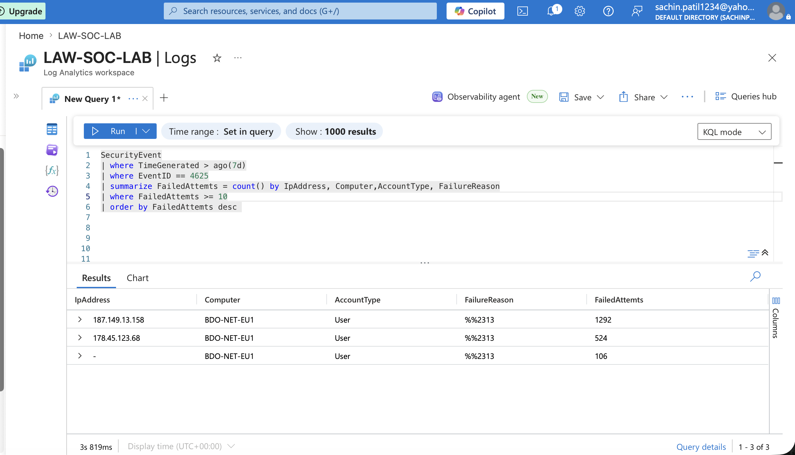

# 🔍 KQL Threat Hunting Queries

- The following KQL queries simulate common investigations performed by Tier 1 SOC Analysts using Microsoft Sentinel.

- These queries focus on authentication monitoring, brute-force detection, suspicious login behavior, and incident triage.

## Query 1 — Top Attacking IP Addresses

### Objective

Identify IP addresses responsible for the highest number of failed RDP authentication attempts.

### KQL Query

```kql
SecurityEvent
| where TimeGenerated > ago(7d)
| where EventID == 4625
| summarize FailedAttempts = count() by IpAddress, Computer, AccountType, FailureReason
| where FailedAttempts >= 10
| order by FailedAttempts desc
```

### Investigation Result



### Analyst Observation

Two external IP addresses generated a significant number of failed authentication attempts against the Azure honeypot. This activity is consistent with automated brute-force or password spraying attacks and would require further investigation in a production SOC environment.
---
